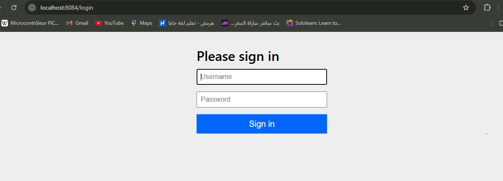
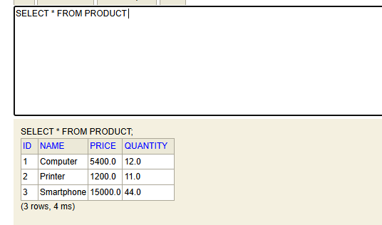

# Rapport Explicatif du Projet Spring MVC avec Sécurité

## Introduction

Ce projet est une application web basée sur **Spring MVC**, intégrant une gestion simple de produits avec des opérations CRUD (création, lecture, suppression), sécurisée par **Spring Security**. L’interface utilisateur est construite avec **Thymeleaf** et le stockage des données est géré via **Spring Data JPA**.

## Structure du Projet

### 1. Entité `Product`

- L'entité `Product` représente un produit avec les attributs suivants :
  - `id` : Identifiant unique généré automatiquement.
  - `name` : Nom du produit, une chaîne de caractères obligatoire (entre 3 et 50 caractères).
  - `price` : Prix du produit (doit être supérieur ou égal à 0).
  - `quantity` : Quantité en stock (doit être au moins 1).
- Validation des données d’entrée avec des annotations **Jakarta Validation** (`@NotEmpty`, `@Size`, `@Min`).

### 2. Repository `ProductRepository`

- Interface héritant de `JpaRepository` pour gérer les opérations CRUD sur l’entité `Product`.
- Permet d’accéder facilement aux données stockées dans la base sans écrire de code SQL.

### 3. Configuration de la Sécurité (`SecurityConfig`)

- **Gestion des utilisateurs en mémoire** via `InMemoryUserDetailsManager` avec trois utilisateurs définis :
  - `user1` et `user2` avec le rôle `USER`.
  - `admin` avec les rôles `USER` et `ADMIN`.
- Mots de passe encodés avec `BCryptPasswordEncoder`.
- Configuration des routes protégées :
  - Pages sous `/user/**` accessibles uniquement aux utilisateurs avec le rôle `USER`.
  - Pages sous `/admin/**` accessibles uniquement aux utilisateurs avec le rôle `ADMIN`.
  - Routes publiques (ex: `/public/**`, `/webjars/**`) accessibles sans authentification.
- Gestion d’une page personnalisée en cas d’accès non autorisé (`/notAuthorized`).
- Page de connexion personnalisée à l’URL `/login`.

### 4. Contrôleur `ProductController`

- Gestion des routes pour afficher et manipuler les produits.
- Accès restreint selon le rôle de l’utilisateur via l’annotation `@PreAuthorize`.
  - Lister les produits (accessible au rôle `USER`).
  - Ajouter un nouveau produit et supprimer un produit (accessible au rôle `ADMIN`).
- Gestion de la validation des données d’entrée lors de la sauvegarde d’un produit.
- Pages de connexion, de déconnexion et d’erreur d’autorisation.

### 5. Vue avec Thymeleaf

- Utilisation d’un template principal `layout1.html` qui inclut la barre de navigation, Bootstrap pour le style, et la gestion dynamique de l’utilisateur connecté.
- Pages spécifiques :
  - `products.html` : affichage de la liste des produits.
  - `new-product.html` : formulaire pour ajouter un produit avec validation et affichage des erreurs.
  - `login.html` : formulaire d’authentification.
  - `notAuthorized.html` : page affichée en cas d’accès refusé.

### 6. Initialisation des données

- Dans la classe principale `BdccFsmSpringMvcApplication`, un `CommandLineRunner` insère automatiquement des produits dans la base de données au démarrage.

## Fonctionnalités principales

- **Authentification et autorisation** : gestion des utilisateurs et des rôles avec Spring Security.
- **Gestion des produits** : affichage, ajout, suppression avec validation des données.
- **Interface utilisateur responsive** grâce à Bootstrap.
- **Sécurisation fine** des endpoints avec annotations `@PreAuthorize`.

## Images / Screenshots

## Conclusion

Ce projet met en œuvre les concepts clés de Spring MVC, Spring Data JPA, et Spring Security pour réaliser une application web sécurisée de gestion de produits. L’usage de Thymeleaf permet une intégration fluide entre la logique serveur et l’affichage dynamique côté client. Le code est clair et respecte les bonnes pratiques de développement Java et Spring.
